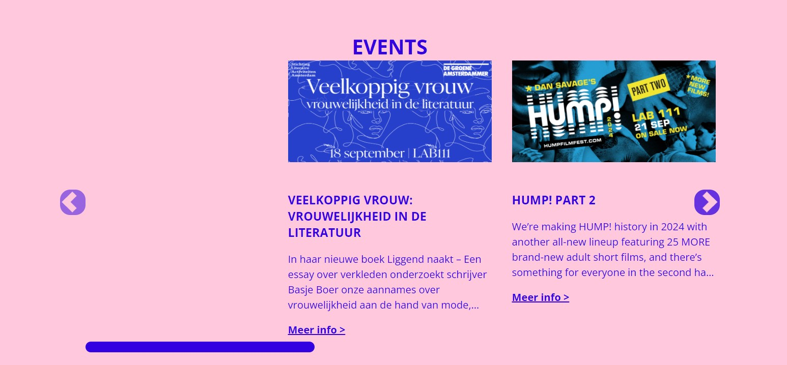

xx# Procesverslag
Markdown is een simpele manier om HTML te schrijven.  
Markdown cheat cheet: [Hulp bij het schrijven van Markdown](https://github.com/adam-p/markdown-here/wiki/Markdown-Cheatsheet).

Nb. De standaardstructuur en de spartaanse opmaak van de README.md zijn helemaal prima. Het gaat om de inhoud van je procesverslag. Besteedt de tijd voor pracht en praal aan je website.

Nb. Door *open* toe te voegen aan een *details* element kun je deze standaard open zetten. Fijn om dat steeds voor de relevante stuk(ken) te doen.

## Jij

  
uitwerken voor kick-off werkgroep

  ### Auteur:
  Teun Dames

  #### Je startniveau:
  Rood

  #### Je focus:
  responsive
 

## Je website

  
uitwerken voor kick-off werkgroep

  ### Je opdracht:
 [link naar de website die je gaat namaken óf de naam/omschrijving van je eigen ontwerp](https://www.lab111.nl/)

  #### Screenshot(s) van de eerste pagina (small screen): 
  LAB111 - home
  

  #### Screenshot(s) van de tweede pagina (small screen):
  hier de naam van de pagina  
  
 

## Toegankelijkheidstest 1/2 (week 1)

  
uitwerken na test in 2e werkgroep

  
  ### Bevindingen
  De site van lab111 mist een h1 op de homepage en gebruikt niet altijd list elementen waar deze nodig zijn.
  Ook heeft de site geen skiplink. De focusorder klopt niet altijd en dark/lightmode is niet supported.

## Breakdownschets (week 1)

  
uitwerken na afloop 3e werkgroep

  ### de hele pagina: 
  

  ### dynamisch deel (bijv menu): 
  

## Voortgang 1 (week 2)

  
uitwerken voor 1e voortgang
S

  ### Verslag van meeting
  hier na afloop snel de uitkomsten van de meeting vastleggen

  - Ik moet de html van mijn 1ste pagina afmaken.
  - Van het werk van anderen viel het op dat ik erg goed moet letten op het netjes houden van mijn html en css.

## Voortgang 2 (week 3)

  
uitwerken voor 2e voortgang
S

  ### Verslag van meeting
  hier na afloop snel de uitkomsten van de meeting vastleggen

  - Als code niet werkt, checken op typo's de code.
  - Niet voor elke tabelcel een th gebruiken, dit is alleen voor de heads van de tabel.
  - In dezelfde week samen met Sanne een carousel gemaakt.

## Toegankelijkheidstest 2/2 (week 4)

  
uitwerken na test in 9e werkgroep

  

  ### Bevindingen
  Ik heb de structuur van de html verbeterd, hierdoor is er beter doorheen te navigeren.
  Beide paginas hebben een h1 bijvoorbeeld.
  Dark mode is nu supported en de dingen die in items moeten zitten in list items.
  Ik heb getwijfeld rondom de items in de shop, maar na overleg bleek dat niet perse te hoeven.

## Voortgang 3 (week 4)

  
uitwerken voor 3e voortgang
S

  ### Verslag van meeting
  hier na afloop snel de uitkomsten van de meeting vastleggen

 - Ik heb gecheckt of ik meerder js bestandjes mocht aanmaken, dat mocht.

## Eindgesprek (week 5)

  
uitwerken voor eindgesprek

  ### Je uitkomst - karakteristiek screenshots:
  
   
  

  ### Dit ging goed/Heb ik geleerd: 
  Korte omschrijving met plaatjes

  Ik heb veel geleerd over hoe specifiek je elementen kan aanspreken zonder het gebruik van classes.
  Verder heb ik geleerd over grid en dit wil ik blijven gebruiken.

  

  Ook viel het mij echt op hoe specifiek je elementen kan selecteren met de css selectoren.

  ### Dit was lastig/Is niet gelukt:
  Het font geïntporteerd krijgen ging niet goed. Dus heb ik het op de manier geïnporteerd die illegaal is in europa.
  Verder denk ik dat ik vooral aan liep tegen uitstel problemen.

  

  Ik vond het lastig om tijdens de feedback rondes vragen te stellen.
  Veel kon ik zelf vinden op het internet of tussendoor in de medialounge vragen aan Sanne of aan vrienden.
  Ik had vooral het gevoel dat ik meer tijd in het coden moest stoppen.

## Bronnenlijst

  
continu bijhouden terwijl je werkt

  Nb. Wees specifiek ('css-tricks' als bron is bijv. niet specifiek genoeg). 
  Nb. ChatGpT en andere AI horen er ook bij.
  Nb. Vermeld de bronnen ook in je code.

 		snapalign:
		https://developer.mozilla.org/en-US/docs/Web/CSS/scroll-snap-type
		https://developer.mozilla.org/en-US/docs/Web/CSS/scroll-snap-align

    copilot gebruikt:
		prompt: I want text to cut off after a specific amount of lines what should the css be?

    Verder heb ik copilot regelmatig laten checken op typfoutjes met prompts zoals:
    This code is not working, is there a typo in the code?
 

